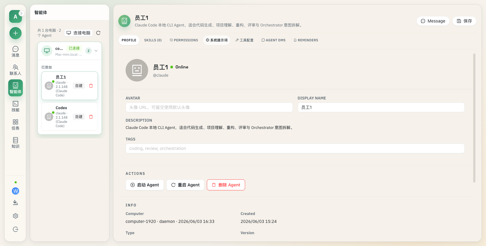

# Di Agent

> 面向团队与企业的多 Agent 协作、任务编排和数据洞察工作台。

Di Agent 以对话为统一入口，把 Claude Code、Codex、OpenCode、OpenClaw、ZCode 等本地 Agent CLI 接入一个可管理的工作空间。用户可以连接电脑、创建智能体、配置 Prompt / Skills / 工具，在单聊或群聊中分派任务，并实时查看执行过程、结构化产物和数据报告。



## 产品能力

- **多 Agent 接入**：Daemon 自动发现本机 Agent CLI，并通过统一协议连接 Di Agent 服务端。
- **会话与协作**：支持用户私聊、Agent 单聊、多人群聊、消息搜索、回复、转发、撤回、置顶、归档与附件。
- **智能编排**：Orchestrator 解析意图、拆解任务、处理依赖，并行调度多个 Worker Agent 后汇总结果。
- **执行监督**：任务看板、进度浮窗、任务时间线和检查器共同展示计划、状态、输出与失败原因。
- **Agent 配置**：独立配置 System Prompt、Skills、MCP 工具、权限、运行时和可复用模板。
- **知识库 RAG**：文件上传、分块、向量召回与 Cross-Encoder 精排，为 Agent 提供长期知识上下文。
- **企业数据报告**：支持数据源、固定报表、运行记录、趋势分析、区域筛选、精确 DUID 查询和权限分层。
- **个人报告**：用户可以从 Agent 对话生成、保存和继续编辑自己的报告工作区。
- **结构化产物**：识别代码、Markdown、网页、文件和报告卡片，支持预览、版本追踪与下载。
- **Web 与桌面端**：同一套 React 工作台可通过浏览器访问，也可以构建为 Electron 桌面客户端。

## 系统架构

```text
┌──────────────────────────────┐
│      Web / Electron Client   │
│ Chat · Agents · Tasks · Data │
└──────────────┬───────────────┘
               │ HTTP / WebSocket
┌──────────────▼───────────────┐
│          Go Backend          │
│ Auth · API · Orchestrator    │
│ Reports · RAG · Artifacts    │
└───────┬──────────────┬───────┘
        │              │ WebSocket
        │       ┌──────▼───────────────┐
        │       │   Di Agent Daemon    │
        │       │ CLI scan · runtime   │
        │       └──────┬───────────────┘
        │              │
┌───────▼────────┐  ┌──▼──────────────────────────┐
│ PostgreSQL     │  │ Claude · Codex · OpenCode   │
│ Redis · RAG    │  │ OpenClaw · ZCode · ...      │
└────────────────┘  └─────────────────────────────┘
```

核心链路：

1. 用户在客户端发起对话、任务或报告请求。
2. 后端完成鉴权、落库、上下文组装与任务编排。
3. Daemon 在目标电脑上调用对应 Agent CLI，并持续回传事件和流式输出。
4. 客户端实时呈现消息、任务进度、产物与报告结果。

## 技术栈

| 模块 | 技术 |
|---|---|
| 后端 | Go 1.26、Gin、PostgreSQL 15、pgvector、Redis |
| 前端 | React 18、TypeScript、Vite、Ant Design、Zustand |
| Daemon | Node.js 18+、WebSocket、本地 CLI 适配层 |
| 桌面端 | Electron |
| RAG | Ollama BGE-M3、Hugging Face TEI、BGE Reranker |
| 测试 | Go Test、Vitest、Node Test、Playwright |

## 快速开始

### 环境要求

- Go 1.26.3+
- Node.js 18+
- Docker 与 Docker Compose
- PostgreSQL 命令行工具 `psql`
- npm

### 获取代码

```bash
git clone https://git.xiaojukeji.com/lijiangli/energy_tag_agent.git
cd energy_tag_agent
```

### 初始化配置

```bash
cp src/backend/config/config.example.yaml src/backend/config/config.yaml
cd src/frontend
npm install
cd ../..
```

编辑 `src/backend/config/config.yaml`，至少确认数据库连接、JWT 密钥、Daemon Token 和服务地址。该文件已被 Git 忽略，不要提交真实凭据。

### 启动开发环境

```bash
bash scripts/dev.sh
```

脚本会启动 PostgreSQL、执行数据库迁移，并同时运行 Go 后端与 Vite 前端：

- Web 工作台：`http://localhost:5173`
- 后端服务：`http://localhost:8080`
- 健康检查：`http://localhost:8080/health`

Redis 缺失时非关键能力会降级；需要 Redis 时可以单独启动：

```bash
docker compose up -d redis
```

### 分别启动

```bash
# 基础设施
docker compose up -d postgres redis

# 后端
cd src/backend
go run ./cmd/server

# 前端
cd src/frontend
npm run dev
```

## 接入一台电脑

在 Di Agent 的“智能体”页面点击“连接电脑”，创建机器 API Key，然后在目标电脑执行页面生成的安装命令。

macOS / Linux 示例：

```bash
curl -fsSL http://<server>:8080/downloads/install.sh \
  | bash -s -- --server-url http://<server>:8080 --api-key <machine-api-key>
```

安装程序会准备 Node.js 运行环境、下载 Daemon 离线包、注册后台服务并立即连接。连接成功后，目标电脑上已登录的 Agent CLI 会出现在 Di Agent 工作台中。

Windows 使用服务端提供的 `install.ps1`，具体命令以“连接电脑”弹窗为准。

## 数据报告

`/reports` 是 Di Agent 的企业数据工作区：

- 普通用户可以查看共享分析、趋势图、分布图，并执行授权的精确查询。
- 管理员可以维护数据源、字段合约、报告定义、调度配置和运行历史。
- 数据源凭据通过服务端环境变量解析，不会返回给报告查看者。
- 报告运行结果以不可变快照保存，支持追踪成功、失败和历史版本。
- 个人报告与对话关联，用户可以从 Agent 生成内容并持续保存迭代。

报告模型和术语见 [`CONTEXT.md`](./CONTEXT.md)，示例配置见 [`src/backend/config/config.example.yaml`](./src/backend/config/config.example.yaml)。

## 知识库 RAG

Di Agent 使用 PostgreSQL + pgvector 保存向量。默认链路为：

```text
文件 → 内容抽取 → 语义分块 → BGE-M3 Embedding
     → HNSW Candidate Top-N → BGE Reranker → Final Top-K
```

启动可选的本地模型服务：

```bash
docker compose --profile rag up -d ollama reranker
```

模型文件放在 `model-cache/`，该目录已被 Git 忽略。更新 Embedding 模型后，需要通过知识库 reindex 接口重建已有向量；只更新 Reranker 不需要重建索引。

## 构建与测试

```bash
# 构建后端二进制与前端产物
bash scripts/build.sh

# 后端测试
bash scripts/test.sh

# 前端生产构建
cd src/frontend && npm run build

# Electron 测试与构建
cd src/frontend
npm run test:electron
npm run build:electron

# Daemon 测试
cd src/daemon-npm && npm test
```

构建产物：

- 后端：`bin/server`
- Web：`src/frontend/dist/`
- Electron：`.tmp/electron-release/`

## 项目结构

```text
.
├── src/
│   ├── backend/          Go API、WebSocket、编排、报告、RAG 与数据层
│   ├── frontend/         React Web 工作台与 Electron 客户端
│   ├── daemon-npm/       当前主要 Daemon 与多 CLI 适配器
│   └── daemon/           Go Daemon 实现
├── scripts/              开发、构建、测试、安装与打包脚本
├── docs/                 Di Agent 产品、UI、领域模型与数据说明
├── doc/                  架构、接口、约定、复盘与历史任务文档
├── .trellis/             AI 协作规范、任务记录与工作流
├── CONTEXT.md            报告领域语言
└── docker-compose.yml    PostgreSQL、Redis 与可选 RAG 服务
```

## 主要页面

| 路径 | 功能 |
|---|---|
| `/` | 对话与任务工作区 |
| `/contacts` | 联系人与好友请求 |
| `/agents` | 电脑、Agent 与运行时管理 |
| `/skills` | Skills 管理 |
| `/knowledge` | 知识库与 RAG |
| `/tasks` | 任务看板 |
| `/reports` | 共享报告与个人报告 |
| `/settings` | 账户和系统设置 |

## 开发约定

- 后端按 `handler → service → repository` 分层，依赖统一在 `cmd/server/main.go` 组装。
- Go 错误使用 `%w` 保留错误链，结构化日志使用 `log/slog`。
- 前端使用严格 TypeScript、CSS Modules 和 Zustand 精确选择器。
- 数据库迁移位于 `src/backend/migrations/`，按编号顺序执行。
- `config.yaml`、`.env*`、模型缓存、上传文件和构建产物不得提交。
- 提交格式为 `type(scope): 中文描述`。

更完整的开发说明：

- [架构说明](./doc/architecture/overview.md)
- [API 参考](./doc/reference/api.md)
- [前端约定](./doc/conventions/frontend-conventions.md)
- [后端约定](./doc/conventions/backend-conventions.md)
- [Git 约定](./doc/conventions/git-conventions.md)
- [脚本说明](./scripts/README.md)
- [UI 设计方向](./docs/design/ui-design-direction.md)

## AI 协作

Di Agent 使用 Trellis 管理跨会话的 AI 开发上下文。需求、调研、实现配置、审查记录和开发日志会持久化在 `.trellis/`，让 Claude Code、Codex、Cursor、OpenCode 等工具能够在同一套项目约定下继续工作。

开始修改前请先阅读 [`AGENTS.md`](./AGENTS.md) 和对应层级的 `.trellis/spec/`。
